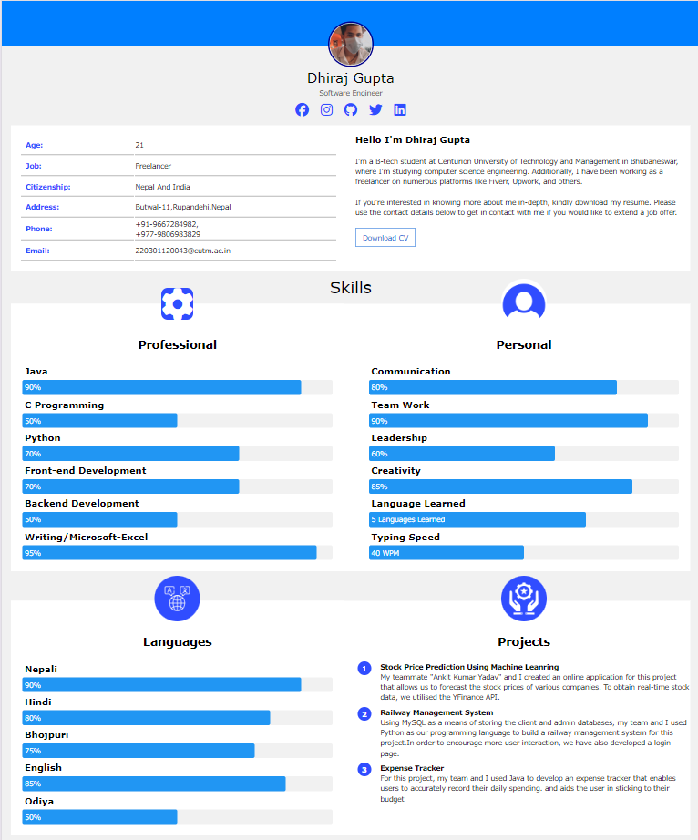

# Resume Using HTML and CSS

This project is a simple personal resume website built using HTML and CSS. The design includes a profile picture, personal details, skills, languages, and projects.

## Screenshot



## How to Use

1. Clone the repository to your local machine using the command:

   ```bash
   git clone https://github.com/tbhhero/Resume_Using_Html_And_CSS.git
   ```

2. Navigate to the project directory:

   ```bash
   cd Resume_Using_Html_And_CSS
   ```

3. Open the `resume.html` file in your web browser to view the resume.

4. You can modify the content in the HTML file to add your own details, such as your name, job title, and skills.

## Features

- Responsive design
- Personal details section
- Skills with progress bars
- Language proficiency section
- Project details section with bullet points

## Contributing

Contributions are welcome! If you would like to contribute, please fork the repository, make your changes, and submit a pull request. For major changes, please open an issue first to discuss what you would like to change.

## Contributors

- Dhiraj Gupta (GitHub: [tbhhero](https://github.com/tbhhero))

## License

This project is licensed under the MIT License - see the [LICENSE](LICENSE) file for details.

## GitHub Repository

[Resume Using HTML and CSS](https://github.com/tbhhero/Resume_Using_Html_And_CSS)
